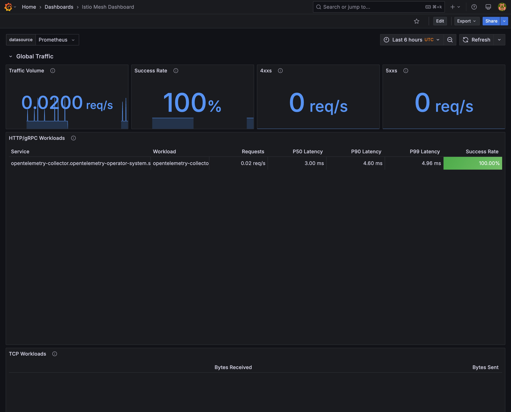

# Observability Cluster

## Getting Started

```bash
# Bootstrap infra
cd observability
make up get-kubeconfig

# Sync Argo CD apps
# (Argo CD server UI available via Istio gateway and DNS name will be print to console)
```

---

## Describe
This folder contains Terraform and Argo CD manifests used to deploy a small EKS cluster for experimenting with logging, monitoring, and tracing tools. The infrastructure provisions Istio and uses Argo CD to manage a collection of Grafana applications.

```text
└── observability
    ├── README.md
    ├── argo
        ├── apps
        │   ├── keda.yaml
        │   ├── kiali.yaml
        │   ├── kube-prometheus-stack.yaml
        │   ├── loki.yaml
        │   ├── mimir.yaml
        │   ├── open-telemetry.yaml
        │   ├── tempo.yaml
        │   └── test-app.yaml
        └── values
        │   ├── keda.yaml
        │   ├── kiali.yaml
        │   ├── kibana.yaml
        │   ├── kube-prometheus-stack
        │       ├── dashboards
        │       │   ├── istio_control_plane.json
        │       │   └── istio_loki.json
        │       ├── kustomization.yaml
        │       ├── values.yaml
        │       └── virtual-service.yaml
        │   ├── loki.yaml
        │   ├── mimir.yaml
        │   ├── open-telemetry
        │       └── collector.yaml
        │   ├── tempo.yaml
        │   └── test-app
        │       ├── deploy.yaml
        │       ├── kustomization.yaml
        │       ├── service-monitor.yaml
        │       ├── service.yaml
        │       └── virtual-service.yaml
    ├── infra
        ├── Makefile
        ├── argocd.tf
        ├── main.tf
        ├── mimir.tf
        ├── providers.tf
        ├── values
        │   ├── argocd.yaml
        │   └── istio.yaml
        ├── variables.tf
        └── versions.tf
    └── test-app
        ├── Dockerfile
        ├── app.py
        └── requirements.txt
```
---

## Components

### 1. Metrics

- **Prometheus** (via the **kube-prometheus-stack** Helm chart)
  - Scrapes Kubernetes metrics (node, pod, service) and Istio telemetry via `ServiceMonitor` objects.
  - Remote-writes long-term storage into **Mimir** to offload local TSDB.  
- **Mimir** (Grafana Mimir Distributed)
  - Acts as a horizontally scalable, multi-tenant remote write store.
  - Receives Prometheus’ remote write streams and persists blocks to S3.
- **Grafana**
  - Sidecar injects dashboards for Istio control plane and Loki.
  - Configured with two data sources:
    - Prometheus (via kube-prometheus-stack)
    - Loki (Logs)
    - Tempo (Traces)

### 2. Logs

- **OpenTelemetry Collector**
  - Receives logs via OTLP HTTP/gRPC and file-log receiver.
  - Batches and exports to **Loki** (Grafana Loki) and `debug` (local logging).
- **Loki**
  - Indexed, cost-effective log store; integrates tightly with Grafana.
  - Schema and storage defined in `loki.yaml` (TSDB backend with filesystem).

### 3. Tracing

- **OpenTelemetry Collector**
  - Receives spans via OTLP.
  - Batches and forwards to **Tempo** (Grafana Tempo).
- **Tempo**
  - Agentless, highly scalable trace store.
  - Generates its own metrics (via `metricsGenerator`) and remote-writes them to Mimir for end-to-end metrics in Grafana.

### 4. Service Mesh Visualization

- **Istio**  
  - Provides Envoy-based service mesh instrumentation:
    - Metrics (`envoy_*`) scraped by Prometheus.
    - Logs (access logs) parsed by OpenTelemetry Collector.
- **Kiali**  
  - Installed in `istio-system` to visualize mesh topology, metrics, and traces.

### 5. Autoscaling

- **KEDA** (Kubernetes Event-Driven Autoscaling)
  - Operator and Metrics Adapter run with Istio sidecar exclusions.
  - Scales workloads based on Prometheus metrics via a `ScaledObject` (not shown here).

---

## Deployment

1. **Bootstrap cluster & Istio**  
   `infra/` contains Terraform code to provision:
   - EKS cluster
   - Istio base, control plane, and ingress gateway (These Helm releases are installed using Terraform because I want to use Istio's `Gateway`, `VirtualService` for ArgoCD)
   - Argo CD server, gateway, and "app-of-apps" application

2. **GitOps with Argo CD**  
   - The `argocd_application.app_of_apps` in Terraform targets `observability/argo/apps/`.
   - Each sub-directory (e.g. `kube-prometheus-stack`, `loki`, `open-telemetry`, etc.) contains an Argo CD `Application` manifest to sync that component.

3. **Custom Values**  
   - All Helm value overrides live under `observability/argo/values/`.
   - Includes dashboards, sidecar datasources, pipeline configs, and Istio annotations.

4. **Test Application**  
   - `observability/test-app` runs a FastAPI service:
   - Automatically instrumented with OpenTelemetry for metrics, traces, and logs.
   - Demonstrates the full pipeline: app → collector → Loki/Tempo/Mimir → Grafana.

---

## How It Works

1. **Instrumentation**  
   - Services (Istio proxies, test-app) generate metrics, logs, and traces.
2. **Collection & Aggregation**  
   - **OpenTelemetry Collector** centralizes logs & traces and forwards to Loki/Tempo.
   - **Prometheus** scrapes metrics and remote-writes to Mimir.
3. **Storage**  
   - **Loki** stores logs, optimized for high-volume unstructured data.
   - **Tempo** stores traces in object storage/backed by index-free design.
   - **Mimir** stores metrics blocks in S3, providing long-term retention.
4. **Visualization**  
   - **Grafana** dashboards present:
     - Control plane health (Istio dashboards)
     - Log search and streams (Loki dashboards)
     - Trace queries and flame graphs (Tempo integration)
     - Application metrics (Prometheus + Mimir)

---

## References
- https://devopsvoyager.hashnode.dev/full-opentelemetry-setup-for-metrics-logs-and-traces-in-kubernetes




